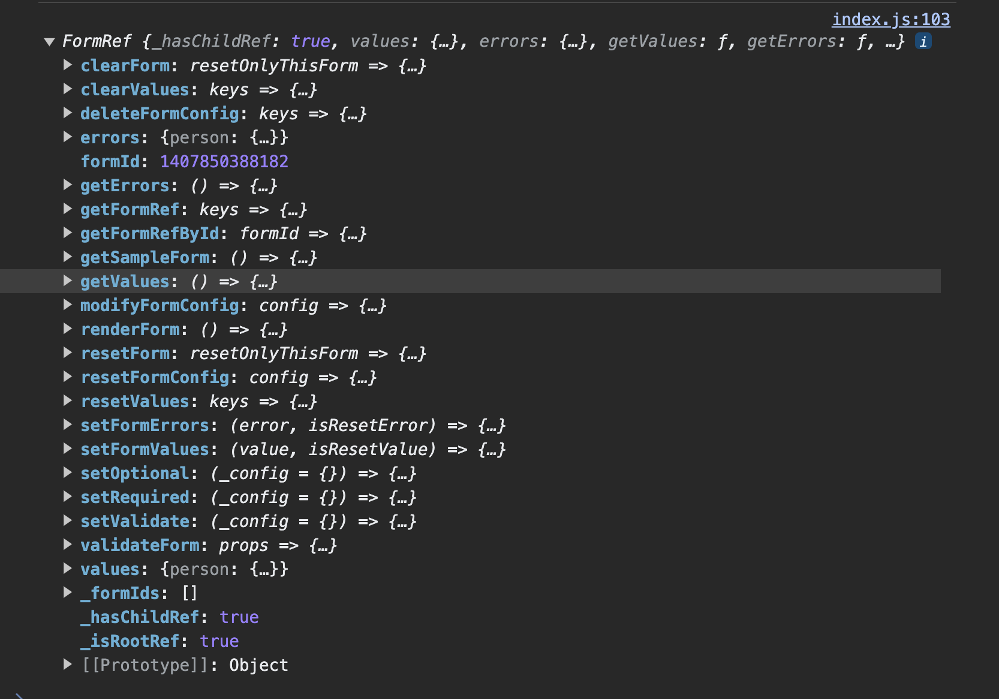
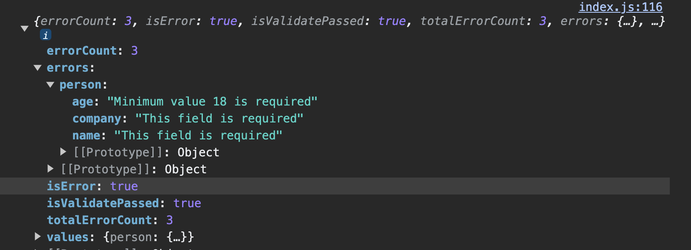
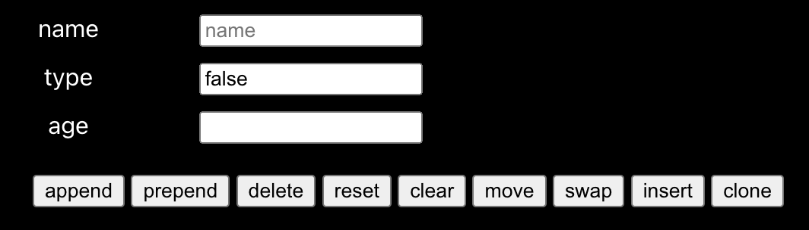
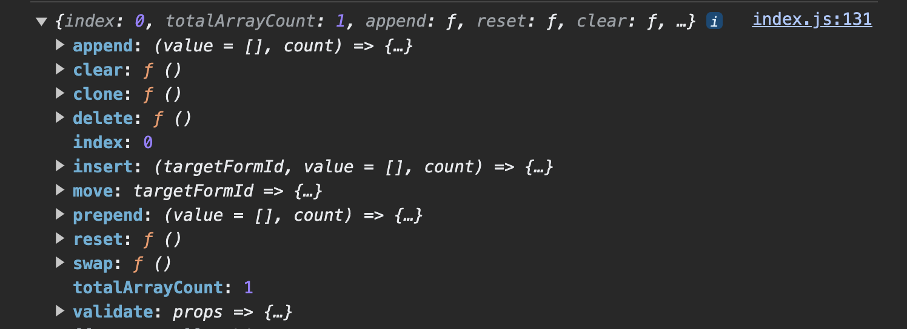
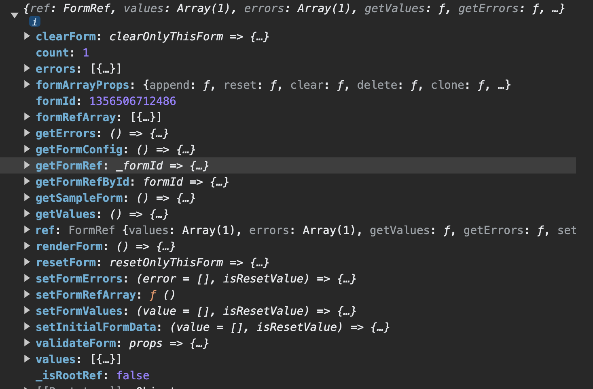

# @cartoonmangodev/react-form-handler

[@cartoonmangodev/react-form-handler]() is a React library for simplifying form validation. It provides a set of utilities and hooks to handle client-side form validation with ease.

## Key features include:

> **Declarative Validation Rules:** Define validation rules in a declarative manner.

> **Dynamic Validation:** Handle dynamic validation based on user input.

> **Custom Validation Functions:** Support for custom validation functions.

## # Installation

This package requires **React 16.8.4 or later.**

Use the package manager [npm](https://nodejs.org/en/) or [yarn](https://yarnpkg.com/) to install @cartoonmangodev/react-form-handler.

```bash
$ npm install @cartoonmangodev/react-form-handler
```

or

```bash
$ yarn add @cartoonmangodev/react-form-handler
```

<!-- ## # Setup

[ Beginner Tutorial](https://github.com/cartoonmangodev/react-form-validation) -->

### Basic Example

```js
/* form.js */
import { FormProvider } from "@cartoonmangodev/react-form-handler";
export const { useForm, useFormRef } = FormProvider();

/* hook.js */
import { useForm } from "./form.js";
const FORM_CONFIG = {
  name: { isRequired: true },
  age: { min: 18, max: 16 },
};

export const useFormHook = () =>
  useForm({
    FORM_CONFIG,
  });

/* customInputField.js */
import { Form } from "@cartoonmangodev/react-form-handler";

export const InputField = React.memo((props) => {
  const { id, name, ...restProps } = props;
  return (
    <Form.Consumer id={id}>
      {({ inputProps }) => (
        <div>
          <div>{name}</div>
          <input {...inputProps} {...restProps} />
          {inputProps.error && <span>{inputProps.error}</span>}
        </div>
      )}
    </Form.Consumer>
  );
});

/* basicForm.js */
import { useEffect, useRef } from "react";
import { useFormHook, Form } from "./hook.js";
import { InputField } from "./customInputField.js";

export const BasicForm = () => {
  const { formRef, formId } = useFormHook();
  return (
    <Form.Provider formRef={formRef}>
      <InputField id="name" />
      <InputField id="age" />
      <Button onClick={formRef.validateForm}>Submit</Button>
    </Form.Provider>
  );
};
```

## # Basic usage

## # Form Configuration

    Note:
    - Its required to configure form Provider before start using useForm hook
    - Global config (one time configuration)

```js
/* form.js */
import { FormProvider, Form } from "@cartoonmangodev/react-form-handler";
import {
  ON_CHANGE,
  ON_BLUR,
  ON_CHANGE,
  ERROR,
} from "@cartoonmangodev/react-form/constants";
const { useForm, useFormRef } = FormProvider({
  ON_CHANGE_KEY: ON_CHANGE /* use ON_CHANGE_TEXT if you are using react-native  */,
  ON_BLUR_KEY: ON_BLUR,
  VALUE_KEY: VALUE,
  ERROR_KEY: ERROR,
});
export { useForm, useFormRef, Form };
```

## Hooks and Components

> **`useForm:`** A hook for managing form state.

> **`useFormRef:`** A hook for obtaining a reference to the form.

> **`Form:`** A form component for use in React components.

## # Getting inputprops using hook

```js
/* customInputField.js */
import { useFormConsumer } from "@cartoonmangodev/react-form-handler";

const InputField = React.memo((props) => {
  const { id, name, ...restProps } = props;
  const { inputProps } = useFormConsumer({ id });
  return (
    <div>
      <div>{name}</div>
      <input {...inputProps} {...restProps} />
      {inputProps.error && <span>{inputProps.error}</span>}
    </div>
  );
});
```

> ## **Note:** Avoiding Unnecessary Re-renders

#### - One significant advantage of using the context-based implementation provided by **`@cartoonmangodev/react-form-handler`** is its ability to minimize unnecessary component re-renders on every onChange.

#### - By managing form state through the FormProvider, components subscribing to the form state will only re-render when relevant form data changes. This can lead to improved performance in scenarios where frequent re-renders are not desired.

## # Getting inputprops using context

```js
/* customInputField.js */
import { Form } from "@cartoonmangodev/react-form-handler";

export const InputField = React.memo((props) => {
  const { id, name, ...restProps } = props;
  return (
    <Form.Consumer id={id}>
      {({ inputProps }) => (
        <div>
          <div>{name}</div>
          <input {...inputProps} {...restProps} />
          {inputProps.error && <span>{inputProps.error}</span>}
        </div>
      )}
    </Form.Consumer>
  );
});
```

## # creating basic form hook config

### - Import

```js
/* hook.js */
import { useForm } from "./form.js";
```

### - Form Configuration

**Define your form configuration using `FORM_CONFIG`. Each field in the form has specific validation rules.**

```js
const FORM_CONFIG = {
  name: { isRequired: true },
  age: { min: 18, max: 16 },
  company: { isRequired: true },
};
```

### - Initialization

**Initialize the form hook using `useForm` and provide the `FORM_CONFIG` and initial state.**

```js
const initialState = {
  name: "",
}; /* optional -  default state */
export const useFormHook = () =>
  useForm({
    FORM_CONFIG,
    initialState,
  });
```

### Usage

```js
import { useForm } from "./form.js";
const FORM_CONFIG = {
  name: { isRequired: true },
  age: { min: 18, max: 16 },
  company: { isRequired: true },
};
export const useFormHook = () =>
  useForm({
    FORM_CONFIG,
    initialState: {
      name: "",
    },
  });
```

## # using form hook in component

### - Import

```js
/* basicForm.js */
import { useEffect, useRef } from "react";
import { useFormHook, Form } from "./hook.js";
import { InputField } from "./customInputField.js";
```

### - Component Definition

**The BasicForm component utilizes the `useFormHook` to manage form state and the Form.**
**`Form.Provider` to wrap the form elements.**

```js
const BasicForm = () => {
  const { formRef, formId } = useFormHook();
  return (
    <Form.Provider formRef={formRef}>
      <InputField id="name" />
      <InputField id="age" />
      <InputField id="company" />
      <Button onClick={formRef.validateForm}>Submit</Button>
    </Form.Provider>
  );
};
```

### Usage

```js
/* basicForm.js */
import { useEffect, useRef } from "react";
import { useFormHook, Form } from "./hook.js";
import { InputField } from "./customInputField.js";

const BasicForm = () => {
  const { formRef, formId } = useFormHook();
  return (
    <Form.Provider formRef={formRef}>
      <InputField id="name" />
      <InputField id="age" />
      <InputField id="company" />
      <Button onClick={formRef.validateForm}>Submit</Button>
    </Form.Provider>
  );
};

export BasicForm;
```

## # creating nested form hook config

### - Import

```js
/* basicForm.js */
import { newSchema } from "@cartoonmangodev/react-form-handler";
import { useForm } from "./form.js";
```

### - Form Configuration

**Define your nested form configuration using `newSchema`. In this example, we have a person schema with nested properties.**

```js
const FORM_CONFIG = {
  person: newSchema({
    name: { isRequired: true },
    age: { min: 18, max: 16 },
    company: { isRequired: true },
  }),
};
```

### - Initialization

**Initialize the form hook using `useForm` and provide the `FORM_CONFIG` with nested schema.**

```js
export const useFormHook = () =>
  useForm({
    FORM_CONFIG,
  });
```

### Usage

```js
/* hook.js */
import { newSchema } from "@cartoonmangodev/react-form-handler";
import { useForm } from "./form.js";

const FORM_CONFIG = {
  person: newSchema({
    name: { isRequired: true },
    age: { min: 18, max: 16 },
    company: { isRequired: true },
  }),
};
export const useFormHook = () =>
  useForm({
    FORM_CONFIG,
  });
```

## # nested form

```js
/* schemaForm.js */
import { useEffect, useRef } from "react";
import { useFormHook, Form } from "./hook.js";
import { InputField } from "./customInputField.js";

const schemaForm = () => {
  const { formRef, formId } = useFormHook();
  console.log(formRef);
  const submit = useCallback(() => {
    console.log(formRef.validateForm());
  }, []);
  return (
    <Form.Provider formRef={formRef}>
      <Form.Provider id="person">
        <InputField id="name" />
        <InputField id="age" />
        <InputField id="company" />
      </Form.Provider>
      <Button onClick={submit}>Submit</Button>
    </Form.Provider>
  );
};
```

1. **This is the image from console FormRef object**



2. **This is the image from console after submitting form**



## # creating formArray hook config

```js
/* hook.js */
import { newFormArray } from "@cartoonmangodev/react-form-handler";
import { useForm } from "./form.js";

const FORM_CONFIG = {
  person: newFormArray({
    name: { isRequired: true },
    age: { min: 18, max: 16 },
    comapny: { isRequired: true },
  }),
};
export const useFormHook = () =>
  useForm({
    FORM_CONFIG,
  });
```

## # FormArray

```js
/* schemaForm.js */
import { useEffect, useRef } from "react";
import { useFormHook, Form } from "./hook.js";
import { InputField } from "./customInputField.js";

const schemaForm = () => {
  const { formRef, formId } = useFormHook();
  console.log(formRef);
  const submit = useCallback(() => {
    console.log(formRef.validateForm());
  }, []);
  return (
    <Form.Provider formRef={formRef}>
      <Form.Multiple id="person">
        {({ formRef: _formRef, form, formId, count, index }, arrayProps) => (
          <Form.Provider formRef={_formRef} key={formId}>
            <InputField id="name" />
            <InputField id="age" />
            <InputField id="company" />
            <button onClick={form.append}>> append</button>
            <button onClick={form.prepend}>prepend</button>
            <button onClick={form.delete}>delete</button>
            <button onClick={form.reset}>reset</button>
            <button onClick={form.clear}>clear</button>
            <button onClick={form.move}>move</button>
            <button onClick={form.swap}>swap</button>
            <button onClick={form.insert}>insert</button>
            <button onClick={form.clone}>clone</button>
            {console.log(arrayProps)}
          </Form.Provider>
        )}
      </Form.Multiple>
      <Button onClick={submit}>Submit</Button>
    </Form.Provider>
  );
};
```

### Explanation

> - The `useFormHook` is used to obtain the form reference and form ID.
> - The `Form.Provider` wraps the entire form and provides context for form handling.
> - The `Form.Multiple` component is used to handle a dynamic array of form elements.
> - The `InputField` component is used for each form field within the dynamic array.
> - Various form manipulation buttons (`append`, `prepend`, `delete`,`reset`,`clear`,`move`,`swap`, `insert`,`clone`,etc.) are provided to showcase the dynamic form functionality.
> - The `submit` function is a callback that triggers form validation and logs the result.





**Form Array methods**



## # Access FormRef Object using useformRef hook

```js
/* hook.js */
import { useFormRef } from "./hook.js";

const form = ({ formId }) => {
  const { formRef, formId } = useFormRef(formId);
  console.log(formRef.getValues());
  console.log(formRef.getErrors());
};
```

## # inputProps - `<Object>`

|  Props   | Default Value |   type   |                               description                               |
| :------: | :-----------: | :------: | :---------------------------------------------------------------------: |
| onChange |   function    | function | A callback function triggered when the value of the component changes.  |
|  onBlur  |   function    | function | A callback function triggered when the component loses focus (on blur). |
|  value   |      any      |   any    |                     The current value of the input                      |
|  error   |    string     |  string  |               An error message associated with the input                |

## # Form config props - `<Object>`

|       Props        | Default Value |   type   |                          value                           |                                        Description                                         |
| :----------------: | :-----------: | :------: | :------------------------------------------------------: | :----------------------------------------------------------------------------------------: |
|     isRequired     |     false     | Boolean  |                     `true or false`                      | A boolean indicating whether the field is required. Throws an error if the field is empty. |
|      optional      |     false     | Boolean  |                     `true or false`                      |    A boolean indicating whether validation should occur only if the field has a value.     |
|        min         |     null      |  number  |                            4                             |                      A number indicating the minimum value required.                       |
|        max         |     null      |  number  |                            8                             |                      A number indicating the maximum value required.                       |
|     maxLength      |     null      |  number  |                            7                             |                    A number indicating the maximum characters allowed.                     |
|     minLength      |     null      |  number  |                            6                             |                    A number indicating the minimum characters required.                    |
|  allowOnlyNumber   |     false     | Boolean  |                     `true or false`                      |                   A boolean indicating whether only numbers are allowed.                   |
|  allowValidNumber  |     false     |  number  |                     `true or false`                      |              A number indicating whether the entered number is valid or not.               |
|        type        |     null      |  number  |                    `"email","number"`                    |            A string indicating the type of validation (`"email"`, `"number"`).             |
|        trim        |     null      | Boolean  |                     `true or false`                      |                      A boolean indicating whether spaces are allowed.                      |
|      pattern       |     null      |  regex   |                          `/$d/`                          |                    A regular expression for custom pattern validation.                     |
|      message       |     null      |  object  |         `{min: 'mimimum 8 characters required'}`         |        An object providing custom error messages for different validation scenarios        |
|     validator      |     null      | function | `(value) => ({error: value < 5 ? 'Error' : null,value})` |                          A function for custom validation logic.                           |
|      callback      |     null      | function |       `({value}) => {console.log('do something')}`       |                            A function called after validation.                             |
|  isValidateOnBlur  |     true      | Boolean  |                     `true or false`                      |                A boolean indicating whether to validate the field on blur.                 |
| isValidateOnChange |     true      | Boolean  |                     `true or false`                      |                A boolean indicating whether to validate the field on change                |
|      vatidate      |     true      | Boolean  |                     `true or false`                      |              A boolean indicating whether to set validation to true or false.              |
|      default       |      ''       |   any    |               `string or object or number`               |                              The default value for the field                               |

## # getValues method

**Get form values using getValues method**

```js
/* hook.js */
import { useFormRef } from "./hook.js";

const form = ({ formId }) => {
  const { formRef, formId } = useFormRef(formId);
  console.log(formRef.getValues());
};
```

## # getErrors method

**Get form errors using getErrors method**

```js
/* hook.js */
import { useFormRef } from "./hook.js";

const form = ({ formId }) => {
  const { formRef, formId } = useFormRef(formId);
  console.log(formRef.getErrors());
};
```

## # clearForm method

**clearForm will reset the form values to default**

```js
/* hook.js */
import { useFormRef } from "./hook.js";

const form = ({ formId }) => {
  const { formRef, formId } = useFormRef(formId);
  formRef.clearForm();
};
```

## # resetForm method

**resetForm will reset the form values to initialState**

```js
/* hook.js */
import { useFormRef } from "./hook.js";

const form = ({ formId }) => {
  const { formRef, formId } = useFormRef(formId);
  formRef.resetForm();
};
```

## # getFormRef method

**getFormRef will be used for nested form to access nested form ref**

```js
/* hook.js */
import { useFormRef } from "./hook.js";

const form = ({ formId }) => {
  const { formRef, formId } = useFormRef(formId);
  formRef.getFormRef(["person"]);
};
```

## # getFormRefById method

**getFormRefById similar to useFormRef for accessing formRef based on formId**

```js
/* hook.js */
const form = ({ formId }) => {
  const { formRef: nestedFormRef, formId } = formRef.getFormRefById(formId);
  console.log(nestedFormRef);
};
```

## # renderForm method

**renderForm will manually render the component**

> #### **Note:** By default components are not rendered on every change

```js
/* hook.js */
import { useFormRef } from "./hook.js";

const form = ({ formId }) => {
  const { formRef, formId } = useFormRef(formId);
  formRef.renderForm();
};
```

## # setFormValues method

**setFormValues will be used for prefill form values**

> #### **Note:** By default only keys in the object will be modified. If you want to reset and set new values, set second params to true

```js
/* hook.js */
import { useFormRef } from "./hook.js";

const form = ({ formId }) => {
  const { formRef, formId } = useFormRef(formId);
  const IS_RESET_FORM = true;
  formRef.setFormValues(
    {
      name: "Person",
    },
    IS_RESET_FORM
  );
};
```

## # validateForm method

**validateForm will be used to validate the form**

```js
/* hook.js */
import { useFormRef } from "./hook.js";

const form = ({ formId }) => {
  const { formRef, formId } = useFormRef(formId);
  const onSubmit = () => {
    console.log(formRef.validateForm());
  };
};
```

## # resetValues method

**validateForm will be used to reset values based on keys**

```js
/* hook.js */
import { useFormRef } from "./hook.js";

const form = ({ formId }) => {
  const { formRef, formId } = useFormRef(formId);
  formRef.resetValues(["name"]);
};
```

## # clearValues method

**clearValues will be used to clear values based on keys**

```js
/* hook.js */
import { useFormRef } from "./hook.js";

const form = ({ formId }) => {
  const { formRef, formId } = useFormRef(formId);
  formRef.clearValues(["name"]);
};
```

## # deleteFormConfig method

**deleteFormConfig will be used to delete the formConfig**

```js
/* hook.js */
import { useFormRef } from "./hook.js";

const form = ({ formId }) => {
  const { formRef, formId } = useFormRef(formId);
  formRef.deleteFormConfig(["age"]);
};
```

## # modifyFormConfig method

**modifyFormConfig will be used to modify the formConfig**

```js
/* hook.js */
import { useFormRef } from "./hook.js";

const form = ({ formId }) => {
  const { formRef, formId } = useFormRef(formId);
  formRef.modifyFormConfig({
    age: {
      type: "number",
    },
  });
};
```

## # resetFormConfig method

**resetFormConfig will be used to reset the formConfig ans set the newConfig**

> ### **Note:** This will remove the old config and set the new config

```js
/* hook.js */
import { useFormRef } from "./hook.js";

const form = ({ formId }) => {
  const { formRef, formId } = useFormRef(formId);
  formRef.modifyFormConfig({
    age: {
      type: "number",
    },
  });
};
```

# Form Array Props

## # append method

**append will add the new form after the target Form**

```js
/* hook.js */
import { useFormRef } from "./hook.js";

const form = ({ formId }) => {
  const { formRef, formId } = useFormRef(formId);
  const { append } = formRef.formArrayProps;

  const onAdd = () => {
    const targetFormId = __formId__;
    const values = [{ name: "steve" }];
    const noOfFormsToBeAdded = 2;
    append(targetFormId, values, noOfFormsToBeAdded);
  };
};
```

## # prepend method

**prepend will add the new form before the target Form**

```js
/* hook.js */
import { useFormRef } from "./hook.js";

const form = ({ formId }) => {
  const { formRef, formId } = useFormRef(formId);
  const { prepend } = formRef.formArrayProps;

  const onAddBefore = () => {
    const targetFormId = __formId__;
    const values = [{ name: "steve" }];
    const noOfFormsToBeAdded = 2;
    prepend(targetFormId, values, noOfFormsToBeAdded);
  };
};
```

## # delete method

**delete method will be used to delete the target form**

```js
/* hook.js */
import { useFormRef } from "./hook.js";

const form = ({ formId }) => {
  const { formRef, formId } = useFormRef(formId);
  const { prepend, delete: deleteForm } = formRef.formArrayProps;

  const onDeleteForm = () => {
    const targetFormId = [__formId1__, __formId2__];
    const values = [{ name: "steve" }];
    deleteForm(targetFormId);
  };
};
```

## # clone method

**clone method will be used to clone the target form**

```js
/* hook.js */
import { useFormRef } from "./hook.js";

const form = ({ formId }) => {
  const { formRef, formId } = useFormRef(formId);
  const { prepend, clone } = formRef.formArrayProps;

  const onCloneForm = () => {
    const sourceFormId = __formId1__;
    const noOfFormsToBeCloned = 2;
    clone(sourceFormId, noOfFormsToBeCloned);
  };
};
```

## # clear method

**clear method will be used to clear the target form**

```js
/* hook.js */
import { useFormRef } from "./hook.js";

const form = ({ formId }) => {
  const { formRef, formId } = useFormRef(formId);
  const { clear } = formRef.formArrayProps;

  const onClearForm = () => {
    const formIds = [__formId1__];
    clear(formIds);
  };
};
```

## # reset method

**reset method will be used to reset the target form**

```js
/* hook.js */
import { useFormRef } from "./hook.js";

const form = ({ formId }) => {
  const { formRef, formId } = useFormRef(formId);
  const { prepend, reset } = formRef.formArrayProps;

  const onResetForm = () => {
    const formIds = [__formId1__];
    reset(formIds);
  };
};
```

## # move method

**move method will be used to move the target form to particular index position**

```js
/* hook.js */
import { useFormRef } from "./hook.js";

const form = ({ formId }) => {
  const { formRef, formId } = useFormRef(formId);
  const { prepend, move } = formRef.formArrayProps;

  const onMoveForm = () => {
    const currentFormId = __formId1__;
    const targetFormId = __formId2__;
    move(currentFormId, targetFormId);
  };
};
```

## # swap method

**move method will be used to swap between two forms**

```js
/* hook.js */
import { useFormRef } from "./hook.js";

const form = ({ formId }) => {
  const { formRef, formId } = useFormRef(formId);
  const { prepend, swap } = formRef.formArrayProps;

  const onSwapForm = () => {
    const currentFormId = __formId1__;
    const targetFormId = __formId2__;
    forms(currentFormId, targetFormId);
  };
};
```

## # insert method

**insert method will be used to insert the new form on particular index**

```js
/* hook.js */
import { useFormRef } from "./hook.js";

const form = ({ formId }) => {
  const { formRef, formId } = useFormRef(formId);
  const { prepend, insert } = formRef.formArrayProps;

  const onInsertForm = () => {
    const targetFormId = __formId__;
    const values = [{ name: "steve" }];
    const noOfFormsToBeInserted = 2;
    insert(targetFormId, values, noOfFormsToBeInserted);
  };
};
```

## # setFormRefArray method

**setFormRefArray method will be used to change the order of the form ans set the new form array**

```js
/* hook.js */
import { useFormRef } from "./hook.js";

const form = ({ formId }) => {
  const { formRef, formId } = useFormRef(formId);
  const { setFormRefArray } = formRef;

  const onSetFormRefArray = () => {
    setFormRefArray([formRef, formRef]);
  };
};
```

## # Render Form

> ### **Note:**
>
> ### - set to true only if required. By default it will be false
>
> ### - It will render component on every form change. Please use it only if required

```js
/* hook.js */
import { newSchema } from "@cartoonmangodev/react-form-handler";
import { useForm } from "./form.js";

const FORM_CONFIG = {
  person: newSchema({
    name: { isRequired: true },
    age: { min: 18, max: 16 },
    comapny: { isRequired: true },
  }),
};
const RENDER_FORM = true;
export const useFormHook = () =>
  useForm({
    FORM_CONFIG,
    renderForm: RENDER_FORM,
  });
```

## # Whether this package will support for react-native

#### **Yes**, this package will support for both [react](https://reactjs.org/) and [react-native](https://reactnative.dev/)

###

<!-- > ### **Note:** Please read the detail documentation from [here](https://cartoonmangodev.github.io/react-boilerplate-redux-saga-hoc-docs/) -->

## Contributing

Pull requests are welcome. For major changes, please open an issue first to discuss what you would like to change.

Please make sure to update tests as appropriate.

## License

Copyright (c) 2023-present Chrissie Fernando

```

```
